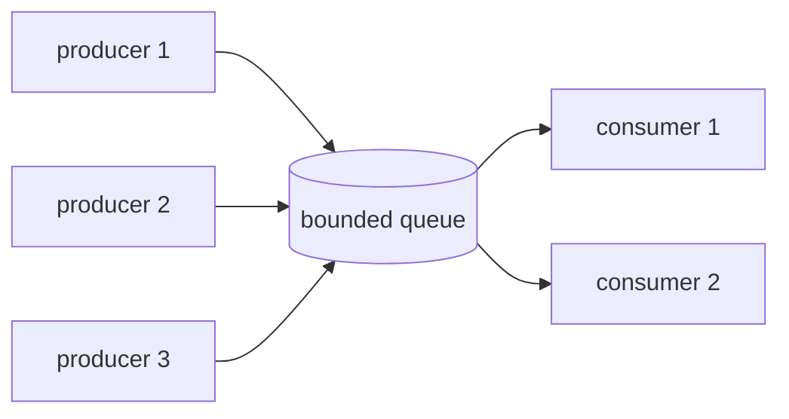
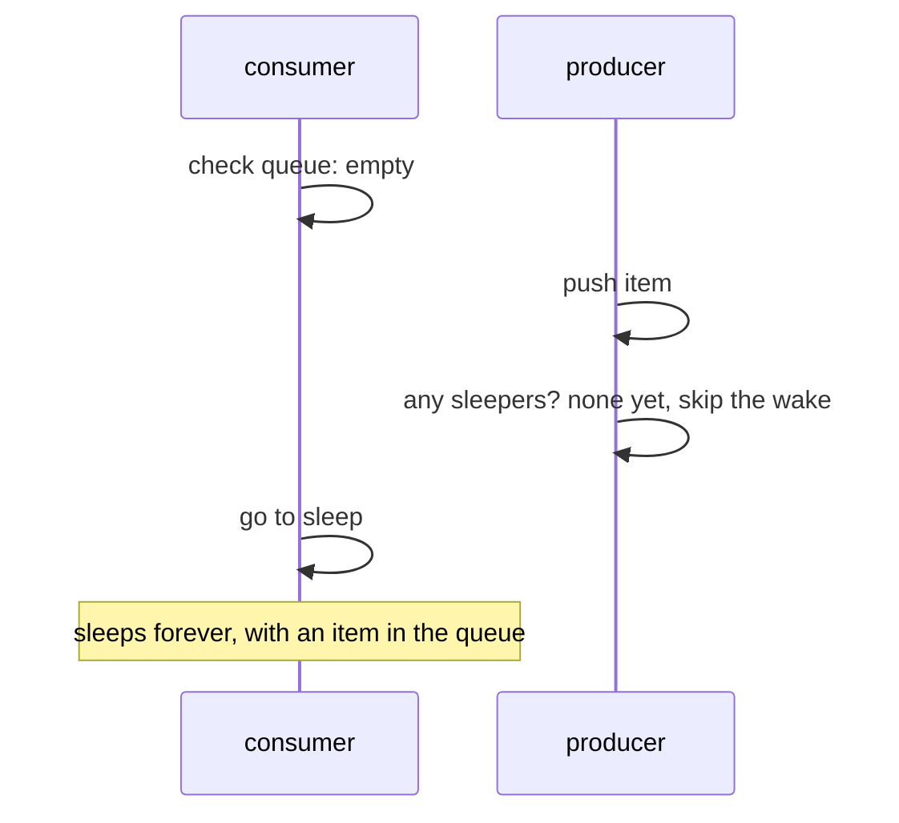
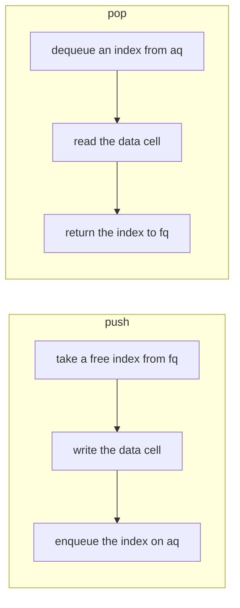
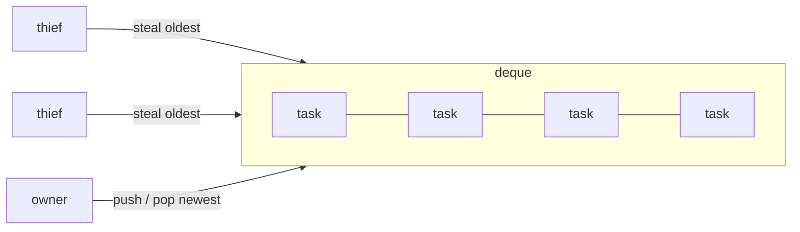

# parkring 1.0: concurrency primitives I tried hard to break

*parkring is a Rust crate with bounded channels and queues, a work-stealing
deque and a work-stealing thread pool. It started as one small queue that
passed all its tests and was still wrong. This is the story of how it got to
1.0: what each piece does, how it works, and what the model checker, Miri and
a fuzzer found along the way, including a hole in a published paper's
algorithm.*

```sh
cargo add parkring
```

---

## What's in the box

Here is the part most people will use, a bounded channel between threads:

```rust
use std::thread;
use parkring::channel;

let (tx, rx) = channel::bounded(64);

// Four producers, each with its own clone of the sender.
let producers: Vec<_> = (0..4u64)
    .map(|id| {
        let tx = tx.clone();
        thread::spawn(move || {
            for i in 0..1_000 {
                tx.send(id * 1_000 + i).unwrap(); // sleeps while the channel is full
            }
        })
    })
    .collect();
drop(tx); // only the producers' clones keep the channel open now

// `iter()` ends once all senders are gone and the channel is empty.
let total: u64 = rx.iter().sum();
assert_eq!(total, (0..4_000).sum());
for p in producers {
    p.join().unwrap();
}
```

Under it sit the pieces that do the real work:

| type | what it is | paper |
|---|---|---|
| `channel::bounded` | MPMC channel, disconnects when one side is dropped | |
| `LockFreeQueue` | bounded MPMC queue, spins then sleeps | Vyukov |
| `ScqQueue` | bounded MPMC queue with a lock-free guarantee (64-bit) | Nikolaev, DISC 2019 |
| `BlockingQueue` | a mutex and two condvars, the reference everything is tested against | |
| `Worker` / `Stealer` | Chase-Lev work-stealing deque | Lê et al., PPoPP 2013 |
| `ThreadPool`, `join` | fork-join pool built on the deque | |

The only dependency is `libc`. A thread that has to wait sleeps in the kernel,
so an idle program uses no CPU. Every component is checked with loom, Miri,
fuzzing and ThreadSanitizer, and benchmarked against the crate you would
otherwise reach for. It wins some of those comparisons and loses others, and
both are written down below.

## 1. The problem: many threads, one queue

Picture a web server. Some threads accept requests, others process them. The
accepting threads need somewhere to put work and the processing threads need
somewhere to take it from. That place is a **queue**, and because many threads
put work in and many take it out, it is a *multi-producer, multi-consumer*
(MPMC) queue.



It should be **bounded**: it holds at most *N* items, and when it is full,
producers wait. That isn't a limitation, it's the point. A bounded queue gives
you *backpressure*. If consumers fall behind, producers slow down instead of
filling memory until the process dies.

So the job is a fixed-size buffer that many threads can push to and pop from
at once, without losing items, without duplicating them, in FIFO order, and
fast.

## 2. The obvious answer: a lock

The simplest correct version is a ring buffer behind a mutex, with two
condition variables: one wakes producers when space frees up, the other wakes
consumers when an item arrives.

```rust
pub fn push(&self, item: T) {
    let mut ring = self.lock.lock().unwrap();
    while ring.is_full() {
        ring = self.not_full.wait(ring).unwrap();   // sleep until a pop
    }
    ring.push(item);
    self.not_empty.notify_one();                     // wake a consumer
}
```

That is `BlockingQueue`, and it is obviously correct. Its problem is just as
obvious: **every** push and pop takes the same lock. With one producer and one
consumer that's fine. With eight of each, the threads spend their time waiting
for each other. At 4 producers and 4 consumers on a 16-slot queue it manages
about 1 million items a second. The lock-free queue below does 19.5 million on
the same test.

## 3. Without a lock: Vyukov's ring

Dmitry Vyukov's bounded MPMC queue removes the global lock. The trick is a
**sequence number in every slot** that says which "turn" the slot is ready
for.

```text
 positions:   0    1    2    3  | 4    5    6    7  | ...   (they only ever grow)
 slots:      [s0] [s1] [s2] [s3]  (position p lives in slot p % 4)

 slot.sequence == p      → empty, waiting for the producer of position p
 slot.sequence == p + 1  → full, waiting for the consumer of position p
 after the consumer      → sequence = p + 4: empty for the next lap
```

A producer reads `tail`, the next position to fill, checks that slot's
sequence, and claims the position with one compare-and-swap. It writes the
item, then publishes it by bumping the sequence. A consumer does the mirror
image on `head`. Producers and consumers working on different slots never
touch the same memory, so they never wait for each other.

Publishing depends on *memory ordering*. The CPU and the compiler are both
allowed to reorder memory operations, so "write the item, then bump the
sequence" is not automatically seen in that order by another core. The bump is
a **Release** store and the consumer's read is an **Acquire** load. Together
they guarantee that a consumer who sees the new sequence also sees the item.
The whole queue rests on that one pairing.

## 4. My first version, and what was wrong with it

My first version had both queues, a mutex one and a Vyukov one, a test suite
that passed, and benchmarks. It was published as `bounded_mpmc_queue` 0.1.
When I came back to turn it into a real library, I audited my own code. It
had real bugs.

**`try_push` failed when the queue wasn't full.** Vyukov's algorithm compares
the sequence with the position *three ways*: equal means claim it, smaller
means full, larger means someone else got there first, so reload and retry.
My version treated anything other than equal, and any lost race, as full:

```rust
Err(_) => return Err(item),   // lost a race: reported as full
...
} else {
    return Err(item);          // stale position: reported as full
}
```

Four threads pushing 8 items each into a 64-slot queue, which never held more
than half its capacity, got **65 rejected pushes**. The blocking `push` only
worked because it retried blindly.

**Capacities that weren't powers of two lost items.** The README said
capacity was rounded up to a power of two. The code didn't do that, but it
indexed with `pos & (capacity - 1)`, which only works for powers of two. A
capacity-3 queue **accepted three pushes and then returned none of them**.

**Idle threads burned a core forever.** A consumer waiting on an empty queue
spun and yielded in a loop. It had no way to sleep and no way to be told the
queue was shutting down.

**The benchmarks measured the wrong thing.** Every timed iteration spawned up
to 32 threads to move 100 items each, so the numbers mostly measured
`thread::spawn`.

All of these are fixed, each with a regression test that fails on the
original code. Then I set out to make sure the next round of bugs would be
caught by tools rather than by luck.

## 5. Waiting without burning a core: spin, then park

When a queue is empty, a consumer has two bad options. It can spin, which
reacts fast but wastes a whole core, or it can sleep, which is cheap but slow
to wake. parkring does both in order: spin briefly (the item often arrives
within microseconds), yield a few times, then **park**, which puts the thread
to sleep in the kernel until someone wakes it.

Parking is where concurrency bugs like to hide. The classic one is the **lost
wakeup**:



The fix is a careful protocol. The consumer *registers* as a waiter, then
*re-checks* the queue before sleeping. The producer publishes the item, then
checks for waiters. The re-check is a read-modify-write on the same atomic the
producer changes, so at least one of the two must see the other. The gap
between "re-checked" and "actually asleep" is closed by sleeping on a
**futex**: the kernel only puts the thread to sleep if a word in memory still
holds the value the thread last saw. If the producer changed it in between,
the sleep doesn't happen.

parkring calls the kernel directly for this, `futex(2)` on Linux and `__ulock`
on macOS, with a `Condvar` fallback everywhere else. Measured with
`getrusage`, a parked consumer uses **about 35 to 55 µs of CPU over 300 ms**.
A spinning one uses all 300 ms.


That chart is the trade-off in one picture. crossbeam's `ArrayQueue` has no
blocking operation, so a waiting consumer has to spin: it notices a new item
in 0.3 µs but burns 100% of a core. parkring wakes in about 9 µs, the cost of
a kernel wakeup, and uses under 2%, about the same as `std::sync::mpsc`.

## 6. Channels: the part you'll actually use

A shared queue with an explicit `close()` is a fine building block, but it
puts shutdown on you. Somebody has to know when the last producer is done and
call `close` exactly once. Channels move that job to the type system:
`channel::bounded(n)` returns a `Sender` and a `Receiver`, both cloneable, and
the channel closes itself when the last handle on either side is dropped.

* Drop the **last `Sender`**, and receivers still get every message that was
  sent. After that, `recv` returns `Err(RecvError)` and `iter()` ends.
* Drop the **last `Receiver`**, and `send` fails at once and hands your
  message back inside `SendError`, so nothing is silently lost.

```rust
use parkring::channel::{self, TrySendError};

let (tx, rx) = channel::bounded(2);
tx.try_send("a").unwrap();
tx.try_send("b").unwrap();
assert_eq!(tx.try_send("c"), Err(TrySendError::Full("c"))); // full: nothing waits

assert_eq!(rx.recv(), Ok("a"));
drop(rx); // the only receiver
assert_eq!(tx.send("d").unwrap_err().into_inner(), "d"); // you get "d" back
```

Underneath, a channel is a `LockFreeQueue` plus two counters, one for live
senders and one for live receivers. Whoever drops the count from one to zero
closes the queue. The names (`try_send`, `recv_timeout`, `TryRecvError` and so
on) follow `std::sync::mpsc` and `crossbeam-channel`, so it should feel
familiar.

The tricky part is the race between the last sender dropping and a receiver
going to sleep. If the receiver checks "anyone still sending?", the sender
drops and closes, and only then does the receiver park, it must still wake
up. That is the same shape as the lost wakeup above, and it gets the same
treatment: loom models of the disconnect races run under both parkers. There
is also a deliberately broken build, `channel_no_disconnect`, that skips the
close, and CI requires loom to catch it.

## 7. How do you test this?

Concurrency bugs depend on timing. A test can pass ten thousand times and fail
on run ten thousand and one, or only on a different CPU. So parkring is
checked by several tools, each blind in a different place.

**Ordinary tests, repeated.** Every queue runs the same suite: FIFO order,
exactly-once delivery across many producer and consumer counts, shutdown,
timeouts. The concurrent tests run in loops, because rare schedules only show
up under repetition.

**Property-based tests.** proptest generates thousands of random operation
sequences and checks each queue against an obviously correct model, Rust's
`VecDeque`. When one fails, it *shrinks* the input to the smallest failing
case.

**loom, a model checker.** loom runs a test under every possible interleaving
of its threads, up to a bound, and models the C++/Rust memory model, including
which stale values a load is allowed to return. A loom test isn't "probably
fine". Within its bound, it has tried every schedule.

**Miri, an interpreter for undefined behaviour.** Miri runs the tests on an
interpreter that checks every pointer, every read of possibly uninitialised
memory, every data race and Rust's aliasing rules. parkring runs it under both
aliasing models (stacked borrows and tree borrows), with both parkers, and
with 16 different scheduling seeds per test for the channel and the Vyukov
queue.

**Fuzzing.** cargo-fuzz drives the queues, the deque (including index
wraparound) and the channel with arbitrary operation sequences and compares
them with sequential models. Each target gets a minute on every pull request
and fifteen minutes every night.

**ThreadSanitizer** watches the queue and channel tests for data races with
real threads on real hardware.

Two rules hold all of this together. First, every atomic, mutex and condvar in
the crate goes through one small module that swaps in loom's versions when
model checking, and CI fails if any code bypasses it. The code loom checks is
the code that ships. Second, a checker that has never been seen to fail
proves very little, so CI also builds **four deliberately broken versions** of
the crate (two missing fences in the deque, a weakened SCQ threshold and the
channel that never disconnects) and requires loom to catch every one.

## 8. What the tools found

This is the part I'm proudest of. Each item was a real bug or a real gap.

**1. A capacity-1 queue overwrote live items.** In a one-slot ring, "full for
this lap" and "empty for the next lap" have the same sequence number, so a
producer could overwrite an item nobody had read. The drop-accounting tests (a
type that counts its constructions and destructions) caught it, and proptest
independently shrank its failure to exactly `capacity = 1`. Vyukov's original
code requires at least two slots for this reason. Mine does now too.

**2. A parking protocol loom couldn't verify.** My first lost-wakeup argument
used `SeqCst` operations, and it is correct under the C++ memory model. But
loom treats `SeqCst` loads and stores as weaker acquire/release operations, so
it reported a deadlock it couldn't rule out. I could have silenced it.
Instead I re-derived the protocol on read-modify-write operations and release
sequences, which loom does model. loom now verifies it, and the fast path got
cheaper as a side effect. Then I broke it on purpose: moving one load after
the re-check makes loom report the deadlock, which shows the test checks
exactly the property the argument depends on.

**3. My futex parker was slower than the mutex it replaced.** The first
version called the kernel's wake function whenever any thread was registered
as a waiter. Under load that meant a system call on almost every operation.
Counting only threads that are actually asleep fixed it, at the cost of a
second race, which two memory fences close. Remove either fence and loom
deadlocks.

**4. A hole in a published algorithm.** More on this in the SCQ section.

**5. The textbook work-stealing bug.** The Chase-Lev deque needs two `SeqCst`
fences. Build it without either one and loom finds the schedule where two
threads take the same element:

```text
assertion `left == right` failed: an element was taken twice: [0, 1, 1]
```

Those two broken builds are among the four that CI requires loom to catch. If
a refactor ever made loom stop noticing, CI would go red.

**6. Two aliasing violations only Miri could see.** When the deque grows, the
old buffer is retired, but a thief may still be reading it. My first version
turned the retired pointer back into a `Box`, which under Rust's aliasing
rules claims unique ownership while another thread is reading. Later, the
thread pool's latch held a `&self` reference that stayed "protected" for the
whole function call, while the waiting thread freed the memory as soon as it
saw the flag. loom can't see either one, because it checks memory orderings,
not aliasing. Miri caught both, and the second only showed up in CI, on a
scheduling seed I hadn't run locally.

**7. An unwind that could free memory another thread was using.** This one
came from reading the code before 1.0, not from a tool, and it's the one I'm
gladdest to have found before anyone depended on the crate. To avoid
allocating, `join(a, b)` keeps job `b` in its own stack frame while another
thread may steal and run it. User panics were already caught and passed back
safely. But if something *inside* parkring panicked in that window (an
internal `expect`, an `unreachable!`), the frame would unwind and be freed
while a thief was still writing into it. Now an `AbortOnUnwind` guard is armed
before the job is shared and disarmed only once its result is back, so that
case aborts the process instead, as Rayon does. `install` has the same guard,
and a worker thread now clears its thread-local pointer if it unwinds. Every
`unsafe` block and the argument for it is listed in
[UNSAFE.md](UNSAFE.md), including the weak spots I know about.

## 9. SCQ: a lock-free queue from a 2019 paper

Vyukov's queue has one subtle weakness: it isn't *lock-free* in the formal
sense. If the OS pauses a producer between claiming a slot and publishing it,
the consumer of that slot has to wait until the producer runs again.

Nikolaev's SCQ ("A Scalable, Portable, and Memory-Efficient Lock-Free FIFO
Queue", DISC 2019) fixes that with a different design. Positions are claimed
with `fetch_add`, which never fails, and a consumer that finds an unpublished
slot *invalidates* it after a short wait, so the producer just takes another
position. No operation ever waits on one particular thread.



The paper uses a *threshold* counter to stop consumers from spinning past an
empty queue forever. A stress test with capacity 1, three producers and three
consumers **hung in 11 of 40 runs**. Dumping the queue's state at the hang
showed an item sitting at exactly the next position to dequeue, with the
threshold at -1, so every consumer gave up before looking at it.

The paper's bound counts positions. It doesn't count consumers that claimed a
position *before* the threshold was reset and decremented it *after*, and how
many of those there can be depends on the number of threads, not the
capacity. The reference implementation is benchmarked with 65,536-slot rings,
where a few threads can never use up the threshold. With one slot, six threads
can. The fix treats the threshold as a hint and never trusts it while
`tail > head`. The test now passes 60 runs out of 60, and a regression test
runs the scenario 200 times with a watchdog.

**Then the honest part: SCQ is slower here, by a lot.** On my 10-core Apple M4
it is **5 to 8 times slower** than the Vyukov queue. Profiling found two
self-inflicted costs, one of them consumers reading the producers' counter on
every operation, which bounced a cache line between cores. Fixing them was
worth about 1.7×. The rest is structural: every item touches two index rings
and a data cell, and on ARM a retried CAS is cheap, so Vyukov's retries cost
less than SCQ's extra work. SCQ earns its place with its progress guarantee,
and the docs say so rather than pretending it wins.

## 10. A work-stealing deque and a thread pool

The last two pieces are the machinery behind Rayon and Tokio.

A **work-stealing deque** has one owner and many thieves. The owner pushes and
pops at one end, like a stack, which is fast and cache-friendly. When another
thread runs out of work, it steals from the *other* end and takes the oldest
task.



The famous difficulty is the last element: the owner pops while a thief
steals at the same moment. The original 2005 algorithm assumes a sequentially
consistent machine, and on real hardware it can hand the same task to both,
which is exactly the bug loom reproduces above. parkring uses the orderings
Lê et al. proved correct in 2013, adapted to today's C++/Rust rules.

The **thread pool** puts it all together. Each worker owns a deque, jobs from
outside arrive through a parkring queue, and idle workers park on the futex.
`join(a, b)` pushes `b`, runs `a`, and then runs `b` itself unless another
worker stole it. Its bookkeeping lives on the caller's stack, so a `join`
never allocates (which is exactly why bug 7 above mattered).

```rust
fn fib(n: u64) -> u64 {
    if n < 20 { return fib_sequential(n); }
    let (a, b) = parkring::join(|| fib(n - 1), || fib(n - 2));
    a + b
}
```


On compute-bound work it scales like Rayon: the same time at 1, 2 and 8
threads, slightly ahead at 4, and 5.3 times faster than sequential code on 8
threads.

## 11. Benchmarks: the wins and the losses

Every number is from one Apple M4 (4 performance and 6 efficiency cores),
with worker threads spawned once and reused, so the measurement is the queue
and not thread creation. The full tables, method and confidence intervals are
in [BENCHMARKS.md](BENCHMARKS.md).


| workload | parkring | best alternative | result |
|---|---|---|---|
| queue, 1 producer + 1 consumer | 91 M items/s | crossbeam: 80 to 85 | parkring faster |
| queue, 2 + 2 up to 16 + 16 | 46 to 62 | crossbeam: 53 to 73 | crossbeam 10 to 17% faster |
| queue, 8 producers + 1 consumer | 7.4 | crossbeam: 12.8 | crossbeam about 70% faster |
| `ScqQueue` | 7 to 13 | `LockFreeQueue`: 51 to 127 | 5 to 8 times slower |
| deque, one thief draining | 85 | crossbeam-deque: 70 | parkring 21% faster |
| deque, 2 or 4 thieves | 10.5 / 5.5 | crossbeam-deque: 10.5 / 5.7 | level |
| pool, `fib(32)` on 8 threads | 1.36 ms | Rayon: 1.36 ms | level |
| pool, `join` at every level, 8 threads | 582 µs | Rayon: 374 µs | Rayon faster |
| waiting consumer: wake / idle CPU | 9.4 µs / 1.7% | `std::sync::mpsc`: 8.8 µs / 1.3% | level |

So, plainly: if you have many producers and consumers and want maximum
throughput, crossbeam's `ArrayQueue` is faster. If you need `select`,
unbounded or zero-capacity channels, use `crossbeam-channel` or `flume`. If
you want parallel iterators or very fine-grained `join` at scale, use Rayon.
parkring blocks threads, so it isn't for `async` code yet.

parkring makes sense when you want a small, heavily checked crate whose
waiting threads sleep instead of spin, with channels, a deque and a pool that
share one parking design.

Some things aren't measured yet: the channel against `crossbeam-channel` and
`flume`, any x86-64 or Linux machine, and latency percentiles under steady
load. They're tracked in
[issue #13](https://github.com/anmol0b/parkring/issues/13), and the contention
gap with crossbeam is
[issue #12](https://github.com/anmol0b/parkring/issues/12).

## 12. What 1.0 promises

1.0 means the public API is frozen. Breaking changes need a 2.0, and a few
decisions were made specifically so that 1.x can grow without breaking anyone:

* **`BoundedQueue` is sealed.** Only parkring's queues implement it, so
  methods can be added in a minor release.
* **Capacity is "at least" what you ask for.** `capacity()` reports the real
  size. The exact rounding isn't part of the contract.
* **A default `std` feature.** Building without it is currently an error, so a
  future `no_std` mode can be added without breaking anyone.
* **MSRV is Rust 1.85**, and raising it is a minor-version change, never a
  patch.
* **CI tests** Linux, macOS and Windows on stable and beta, plus 32-bit i686
  and AArch64 Linux, with a build check on FreeBSD.

The public API is snapshotted in `public-api.txt` and checked on every pull
request, along with cargo-semver-checks against the last release, so an
accidental breaking change fails CI instead of reaching users.

## 13. What I took away

- **Write the test that would have caught the bug first.** Every bug in this
  project has a test that failed before the fix.
- **Make your checker able to check you.** When loom couldn't verify my
  design, the right move was to change the design, not to silence loom.
- **Break things on purpose.** The four broken builds in CI keep the model
  checking honest. A suite that has never been seen to fail proves little.
- **Use more than one tool.** loom found ordering bugs, Miri found aliasing
  bugs loom can't see, a plain stress test found a hole in a paper, and
  reading the code found the unwind hole. No single tool would have found all
  of them.
- **Publish the losses.** SCQ is slower here, and crossbeam beats my queue
  under contention. Saying so, with the profiling that explains why, is worth
  more than a table that only shows wins.

---

parkring 1.0 is on [crates.io](https://crates.io/crates/parkring), the docs
are on [docs.rs](https://docs.rs/parkring), and the code, design notes and
every benchmark are at
**[github.com/anmol0b/parkring](https://github.com/anmol0b/parkring)**.
Issues and pull requests are welcome, especially benchmarks from x86-64 and
Linux machines.
