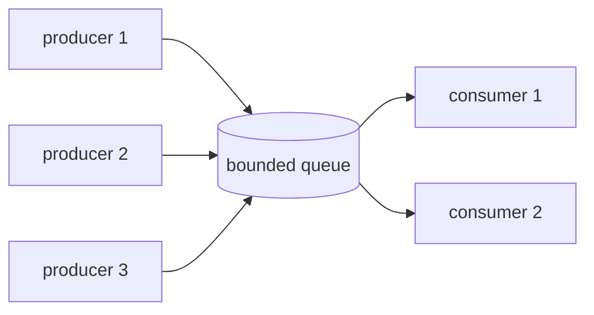
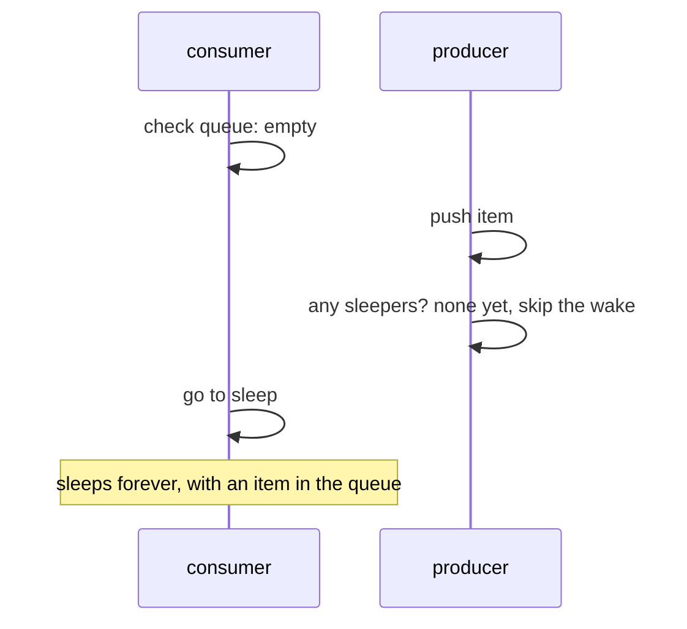
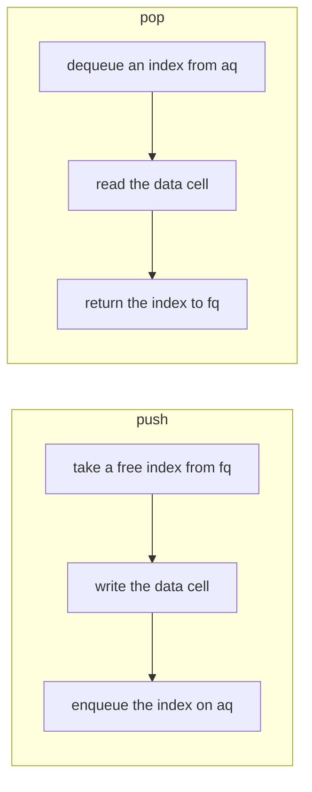
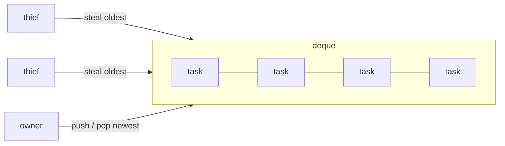

# From a first-draft queue to a verified concurrency library

*How my first bounded queue grew into **parkring**: three
queues, a work-stealing deque and a thread pool, each checked by a model checker
and benchmarked against the crates people actually use. Along the way the tools
found real bugs, including one in a published paper's algorithm.*

---

## 1. The problem: many threads, one queue

Imagine a web server. Some threads accept requests, other threads process them.
The accepting threads need somewhere to put work, and the processing threads
need somewhere to take it from. That somewhere is a **queue**, and because many
threads put work in and many take it out, it is a *multi-producer,
multi-consumer* (MPMC) queue.



It should be **bounded**: it holds at most *N* items. When it is full, producers
wait. That is not a limitation, it is the point. A bounded queue gives you
*backpressure*: if consumers fall behind, producers slow down instead of
filling memory until the process dies.

So the job is: a fixed-size buffer that many threads can push to and pop from
at the same time, without losing items, without duplicating them, in FIFO order,
and fast.

## 2. The obvious solution: a lock

The simplest correct answer is a ring buffer behind a mutex, plus two condition
variables: one to wake producers when space frees up, one to wake consumers when
an item arrives.

```rust
pub fn push(&self, item: T) {
    let mut ring = self.lock.lock().unwrap();
    while ring.is_full() {
        ring = self.not_full.wait(ring).unwrap();   // sleep until a pop
    }
    ring.push(item);
    self.not_empty.notify_one();                     // wake a consumer
}
```

This is `BlockingQueue` in parkring, and it is obviously correct. Its problem is
equally obvious: **every** push and pop takes the same lock. With one producer
and one consumer that is fine. With eight of each, threads spend their time
waiting for each other, and throughput collapses.

## 3. Without a lock: Vyukov's ring

Dmitry Vyukov's bounded MPMC queue removes the global lock. The trick is a
**sequence number in every slot**, saying which "turn" the slot is ready for.

```text
 positions:   0    1    2    3  | 4    5    6    7  | ...   (they only ever grow)
 slots:      [s0] [s1] [s2] [s3]  (position p lives in slot p % 4)

 slot.sequence == p      → empty, waiting for the producer of position p
 slot.sequence == p + 1  → full, waiting for the consumer of position p
 after the consumer      → sequence = p + 4: empty for the next lap
```

A producer reads `tail` (the next position to fill), checks that slot's sequence,
and claims the position with a single compare-and-swap. It writes the item and
then publishes it by bumping the sequence. A consumer does the mirror image on
`head`. Producers and consumers working on different slots never touch the same
memory, so they never wait for each other.

The publishing step depends on *memory ordering*. A CPU, and the compiler, may
reorder memory operations, so "write the item, then bump the sequence" is not
automatically seen in that order by another core. The bump is a **Release**
store and the consumer's read is an **Acquire** load. Together they guarantee that
a consumer who sees the bumped sequence also sees the item. This one pairing is
what the whole queue rests on.

## 4. The first version, and what was wrong with it

My first version had both queues: a mutex queue, a Vyukov queue, 20 tests
that all passed, and benchmarks. When I came back to turn it into a real
project, I audited my own code. It had real bugs.

**`try_push` failed when the queue was not full.** Vyukov's algorithm compares
the sequence with the position *three ways*: equal means claim it, smaller means
full, larger means "someone else got here first, reload and retry". My version
treated *anything* other than equal, and any lost race, as "full":

```rust
Err(_) => return Err(item),   // lost a race: reported as full
...
} else {
    return Err(item);          // stale position: reported as full
}
```

A quick experiment with four threads pushing 8 items each into a 64-slot queue
(never more than half full) produced **65 rejected pushes**. The blocking `push`
only worked because it retried blindly.

**Non-power-of-two capacities lost items.** The README claimed capacity was
rounded up to a power of two; the code didn't do it, but indexed with
`pos & (capacity - 1)`, which only works for powers of two. A capacity-3 queue
**accepted three pushes and then returned none of them**.

**Idle threads burned a CPU core forever.** A consumer waiting on an empty queue
spun and yielded in a loop, with no way to sleep and no way to shut the queue
down.

**The benchmarks measured the wrong thing.** Each timed iteration spawned up to
32 threads that moved 100 items each, so the numbers mostly measured
`thread::spawn`.

All of these are fixed, each with a regression test that failed on the original
code. Then I set out to make sure the next round of bugs would be caught by
tools rather than by luck.

## 5. Waiting without burning a core: spin, then park

When a queue is empty, a consumer has two bad options. It can spin, which is
fast to react but wastes a whole core, or it can sleep, which is cheap but slow
to wake. parkring does both in sequence: spin briefly (the item often arrives
within microseconds), yield a few times, then **park**, which puts the thread to
sleep in the kernel until someone wakes it.

Parking is where concurrency bugs love to hide. The classic one is the **lost
wakeup**:



The fix is a careful protocol. The consumer *registers* as a waiter, then
*re-checks* the queue before sleeping. The producer publishes the item, then
checks for waiters. The re-check uses a read-modify-write on the same atomic the
producer modifies, so one of the two must see the other. The window between
"re-check" and "actually asleep" is closed by sleeping on a **futex**: the
kernel only puts the thread to sleep if a word in memory still has the value the
thread saw. If the producer changed it in between, the sleep doesn't happen.

parkring calls the kernel directly for this: `futex(2)` on Linux and `__ulock` on
macOS, with a portable `Condvar` fallback elsewhere. The payoff, measured: a
parked consumer uses **a few dozen microseconds of CPU over 300 ms**. A spinning
one uses the whole 300 ms.


The chart is the trade-off in one picture. crossbeam's queue has no blocking
operation, so a waiting consumer must spin: it wakes in 0.3 µs but burns 100% of
a core. parkring wakes in about 9 µs, the cost of a kernel wakeup, and uses under
2%.

## 6. How do you test this?

Concurrency bugs depend on timing. A test can pass ten thousand times and fail
on the ten-thousand-and-first, or only on a different CPU. parkring uses four
layers.

**Ordinary tests, repeated.** Every queue runs the same suite: FIFO order,
exactly-once delivery across many producer/consumer shapes, shutdown, timeouts.
Concurrent tests run many times in a loop, because rare schedules only appear
under repetition.

**Property-based tests.** proptest generates thousands of random operation
sequences and checks each queue against a trivially correct model, Rust's
`VecDeque`. When something fails, it *shrinks* the input to the smallest failing
case.

**loom, a model checker.** loom runs a test under every possible interleaving of
its threads (up to a bound), and models the C++/Rust memory model, including
which stale values a load is allowed to return. A loom test isn't "probably
fine": within its bound it has explored every schedule.

**Miri, an interpreter for undefined behaviour.** Miri runs the tests on an
interpreter that checks every pointer, every read of possibly uninitialised
memory, every data race, and Rust's aliasing rules.

The project only uses loom-checkable primitives. Every atomic, mutex and condvar
in the crate goes through one small module that swaps in loom's versions when
model checking, and CI fails if anything bypasses it. The code that is
model-checked is the code that ships.

## 7. What the tools found

This is the part I'm proudest of. Each of these was a real bug or a real gap,
found by a tool rather than by inspection.

**1. A capacity-1 queue overwrote live items.** In a one-slot ring, "full for
this lap" and "empty for the next lap" have the same sequence number, so a
producer could overwrite an item nobody had read. The drop-accounting tests (a
type that counts its constructions and destructions) caught it, and proptest
independently shrank its failure to exactly `capacity = 1`. Vyukov's original
asserts a minimum of two slots for this reason; mine now does too.

**2. A parking protocol loom could not verify.** My first lost-wakeup argument
used `SeqCst` (sequentially consistent) operations, and it is correct under the
C++ memory model. But loom models `SeqCst` loads and stores as weaker
acquire/release operations, so it reported a deadlock it could not rule out. I
could have suppressed the report. Instead I re-derived the protocol on
read-modify-write operations and release sequences, which loom *does* model.
loom now verifies it, and the fast path got cheaper as a side effect. Then a
deliberate break: moving one load after the re-check makes loom report a
deadlock, which shows the test checks exactly the property the proof depends on.

**3. My futex parker was slower than the mutex it replaced.** The first version
called the kernel's wake function whenever any thread was registered as
waiting. Under load that meant a system call on every operation. Counting only
threads actually asleep fixed it, at the cost of a second race, which two memory
fences close. Removing either fence makes loom deadlock.

**4. A hole in a published algorithm.** More on this in the SCQ section below.

**5. The textbook work-stealing bug.** The Chase-Lev deque needs two `SeqCst`
fences. Build it without one and loom finds the schedule where two threads take
the same element:

```text
assertion `left == right` failed: an element was taken twice: [0, 1, 1]
```

CI builds both broken versions on every push and *requires* that failure. If a
refactor ever made loom stop noticing, CI would go red.

**6. Two aliasing violations only Miri could see.** When the deque grows, the
old buffer is retired, but a thief thread may still be reading it. My first
version turned the retired pointer back into a `Box`, which under Rust's aliasing
rules asserts unique ownership while another thread is reading. Later, the
thread pool's latch held a `&self` reference that stayed "protected" for the
whole function call, while the waiting thread freed the memory as soon as it saw
the flag. Neither is visible to loom, which checks memory orderings, not
aliasing. Miri caught both. The second one only showed up in CI, on a different
scheduling seed than I had run locally.

## 8. SCQ: a lock-free queue from a 2019 paper

Vyukov's queue has a subtle weakness: it is not *lock-free* in the formal sense.
If a producer is paused by the OS between claiming a slot and publishing it, the
consumer of that slot must wait until the producer runs again.

Nikolaev's SCQ ("A Scalable, Portable, and Memory-Efficient Lock-Free FIFO
Queue", DISC 2019) fixes this with a different design. Positions are claimed with
`fetch_add`, which never fails, and a consumer that finds an unpublished slot
*invalidates* it after a short wait, so the producer just takes another
position. No operation ever waits on a particular other thread.



The paper uses a *threshold* counter to stop consumers from spinning past an
empty queue forever. A stress test with capacity 1 and three producers plus
three consumers **hung in 11 of 40 runs**. Dumping the queue's state at the hang
showed an item sitting at exactly the next position to dequeue, with the
threshold at −1, so every consumer gave up before looking.

The paper's bound counts positions. It does not count consumers that claimed a
position *before* the threshold was reset and decremented it *after*, and their
number depends on the thread count, not the capacity. The reference
implementation is benchmarked with rings of 65,536 slots, where a few threads can
never exhaust the threshold. With one slot, six threads can. The fix keeps the
threshold as a hint and never trusts it while `tail > head`. The test now passes
60 runs out of 60, and a regression test runs the scenario 200 times with a
watchdog.

**And then the honest part: SCQ is slower here, by a lot.** On my 10-core Apple
M4 it is **5–8× slower** than the Vyukov queue. Profiling found two
self-inflicted costs: consumers reading the producers' counter on every
operation, which bounced a cache line between cores. Fixing them gave 1.7×. The
rest is structural: every item touches two index rings and a data cell. SCQ
earns its place through its progress guarantee, and the documentation says so
rather than pretending it wins.

## 9. A work-stealing deque and a thread pool

The last two pieces are the machinery behind Rayon and Tokio.

A **work-stealing deque** has one owner and many thieves. The owner pushes and
pops at one end, like a stack, which is fast and cache-friendly. When another
thread runs out of work, it steals from the *other* end, taking the oldest task.



The famous difficulty is the last element: the owner popping and a thief
stealing at the same moment. The original 2005 algorithm assumes a
sequentially consistent machine. On real hardware it can hand the same task to
both, which is exactly the bug loom reproduces above. parkring uses the
orderings Lê et al. proved correct in 2013, adapted to today's C++/Rust rules.

The **thread pool** puts it all together. Each worker owns a deque; jobs from
outside go through a parkring queue; idle workers park on the futex wait queue.
`join(a, b)` pushes `b`, runs `a`, and then runs `b` itself unless another worker
stole it. Its bookkeeping lives on the caller's stack, so a join never allocates.

```rust
fn fib(n: u64) -> u64 {
    if n < 20 { return fib_sequential(n); }
    let (a, b) = parkring::join(|| fib(n - 1), || fib(n - 2));
    a + b
}
```


On a compute-bound job it scales like Rayon: identical at 1, 2 and 8 threads,
slightly ahead at 4, and 5.3× faster than sequential code on 8 threads.

## 10. Benchmarks

All numbers are from an Apple M4, with worker threads spawned once and reused, so
the measurement is the queue and not thread creation. The full tables are in
[BENCHMARKS.md](BENCHMARKS.md).


| workload | parkring | reference |
|---|---|---|
| queue, 1 producer + 1 consumer | 91 M items/s | 80 (crossbeam) |
| queue, 8 + 8 | 51 M items/s | 57 (crossbeam) |
| deque, one thief draining | 85 M items/s | 70 (crossbeam-deque) |
| pool, `fib(32)` on 8 threads | 1.36 ms | 1.36 ms (Rayon) |
| parked consumer | wakes in 9.4 µs, 1.7% CPU | 0.3 µs, 100% CPU (spinning) |

Some of these are wins and some are losses. crossbeam's queue is faster under
heavy contention, and in the asymmetric case of eight producers feeding one
consumer it is clearly ahead:


Capacity matters most for the mutex queue: with 16 slots and 4 producers plus 4
consumers it drops to about 1 M items/s, while the Vyukov queue stays about 20×
above it:


## 11. What I took away

- **Write the test that would have caught the bug first.** Every bug in this
  project now has a test that failed before the fix.
- **Make your checker able to check you.** When loom couldn't verify my design, the
  right move was to change the design, not to silence loom.
- **Break things on purpose.** A model-checking suite that has never been seen to
  fail proves little. The deliberately broken builds in CI keep the tests honest.
- **Use more than one tool.** loom found ordering bugs; Miri found aliasing bugs
  loom can't see; plain stress tests found a hole in a paper. No single tool
  would have found all of them.
- **Publish the losses.** SCQ is slower here, and crossbeam beats my queue under
  contention. Saying so, with the profiling that explains why, is worth more than
  a benchmark table that only shows wins.

The code, design notes and every benchmark are at
**[github.com/anmol0b/parkring](https://github.com/anmol0b/parkring)**.
